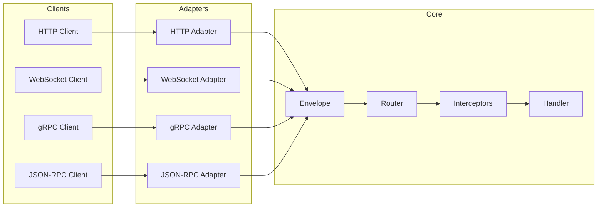

# ⚡ Raffel

**Unified Multi-Protocol Server Runtime**

Raffel is a protocol-agnostic server framework that lets you write handlers once and expose them over HTTP, WebSocket, gRPC, JSON-RPC, GraphQL, TCP, and UDP. Same validation, same auth, same interceptors—all protocols.

---

## Why Raffel?

```typescript
// Define once
server.procedure('users.create')
  .input(z.object({ name: z.string(), email: z.string().email() }))
  .handler(async (input) => db.users.create({ data: input }))

// Expose everywhere
// ✓ HTTP POST /users.create
// ✓ WebSocket { procedure: 'users.create', payload: {...} }
// ✓ gRPC UsersService.Create()
// ✓ JSON-RPC { method: 'users.create', params: {...} }
// ✓ GraphQL mutation { usersCreate(...) }
// ✓ TCP/UDP raw protocol support
```

---

## Quick Start

<div class="grid-3">
<a href="#/quickstart" class="card">
<div class="icon">🚀</div>
<h4>Quickstart</h4>
<p>Get up and running in under 5 minutes</p>
</a>

<a href="#/core-model" class="card">
<div class="icon">🎯</div>
<h4>Core Model</h4>
<p>Understand Envelope, Context, and handlers</p>
</a>

<a href="#/protocols/http" class="card">
<div class="icon">🌐</div>
<h4>HTTP Adapter</h4>
<p>REST API with automatic routing</p>
</a>
</div>

---

> [!TIP]
> Press `/` to search the docs instantly. Use ↑↓ to navigate results.

## 10‑Minute Flight Plan

<div class="grid-4">
<a href="#/quickstart" class="card">
<div class="icon">1️⃣</div>
<h4>Boot the Server</h4>
<p>Install, register validation, and ship your first handler.</p>
</a>

<a href="#/core-model" class="card">
<div class="icon">2️⃣</div>
<h4>Learn the Envelope</h4>
<p>Understand how every protocol maps to a single core model.</p>
</a>

<a href="#/handlers/procedures" class="card">
<div class="icon">3️⃣</div>
<h4>Procedures + Streams</h4>
<p>RPC, streaming, and events with validation + types.</p>
</a>

<a href="#/interceptors" class="card">
<div class="icon">4️⃣</div>
<h4>Make It Production</h4>
<p>Auth, retries, timeouts, metrics, tracing, caching.</p>
</a>
</div>

---

## What's Inside

| Category | Features |
|:---------|:---------|
| **Protocols** | HTTP • WebSocket • gRPC • JSON-RPC • GraphQL • TCP • UDP |
| **Handler Types** | Procedures (RPC) • Streams (Server/Client/Bidi) • Events (Pub/Sub) |
| **Validation** | Zod • Yup • Joi • Ajv • fastest-validator |
| **Auth** | JWT • API Key • OAuth2 • OIDC • Basic • Session |
| **Resilience** | Rate Limit • Circuit Breaker • Retry • Timeout • Bulkhead • Fallback |
| **Observability** | Prometheus Metrics • OpenTelemetry Tracing • Structured Logging |
| **Caching** | Memory • Redis • S3DB • Read-through • Write-through |
| **Real-time** | Channels (Pusher-like) • Presence • Broadcasting |
| **Documentation** | USD (Universal Service Docs) • Auto-generated from schemas |
| **DX** | Hot Reload • File-based Routing • REST Auto-CRUD |

---

## First Server (Production‑Ready)

Create a multi‑protocol server with validation, logging, and error handling:

```typescript
import { createServer, createZodAdapter, registerValidator, Errors } from 'raffel'
import { z } from 'zod'

registerValidator(createZodAdapter(z))

const server = createServer({
  port: 3000,
  websocket: true,
  jsonrpc: '/rpc',
  graphql: '/graphql',
})

server
  .procedure('users.create')
  .input(z.object({ name: z.string().min(2), email: z.string().email() }))
  .output(z.object({ id: z.string(), name: z.string(), email: z.string() }))
  .handler(async (input) => {
    if (input.email.endsWith('@example.com')) {
      throw Errors.unprocessable('Example.com emails are not allowed')
    }
    return { id: crypto.randomUUID(), ...input }
  })

await server.start()
```

Test across protocols:

```bash
# HTTP
curl -X POST http://localhost:3000/users.create \
  -H 'Content-Type: application/json' \
  -d '{"name":"Ada","email":"ada@open.com"}'

# WebSocket
wscat -c ws://localhost:3000/ws \
  -x '{"procedure":"users.create","payload":{"name":"Ada","email":"ada@open.com"}}'

# JSON-RPC
curl -X POST http://localhost:3000/rpc \
  -H 'Content-Type: application/json' \
  -d '{"jsonrpc":"2.0","id":"1","method":"users.create","params":{"name":"Ada","email":"ada@open.com"}}'
```

---

## Architecture



Every request is normalized into an **Envelope** with a consistent structure:

```typescript
interface Envelope {
  id: string           // Request correlation ID
  procedure: string    // Handler name (e.g., 'users.create')
  type: 'request' | 'response' | 'stream:data' | 'event'
  payload: unknown     // Your input/output data
  context: Context     // Auth, tracing, deadline
}
```

--- 

## Handler Types

### Procedures (RPC)

Request-response pattern. One input, one output.

```typescript
server.procedure('math.add')
  .input(z.object({ a: z.number(), b: z.number() }))
  .output(z.object({ result: z.number() }))
  .handler(async ({ a, b }) => ({ result: a + b }))
```

### Streams

Generator-based streaming with backpressure support.

```typescript
server.stream('logs.tail')
  .input(z.object({ file: z.string() }))
  .handler(async function* ({ file }) {
    for await (const line of readLines(file)) {
      yield { line, timestamp: Date.now() }
    }
  })
```

### Events

Fire-and-forget with configurable delivery guarantees.

```typescript
server.event('emails.send')
  .delivery('at-least-once')  // or 'best-effort', 'at-most-once'
  .handler(async (payload, ctx, ack) => {
    await sendEmail(payload)
    ack()  // Acknowledge delivery
  })
```

---

## Production Checklist

When you’re ready to ship, most services follow this pattern:

1. **Validation adapter** — `registerValidator(createZodAdapter(z))`
2. **Interceptors** — rate limit, retry, timeout, logging
3. **Auth** — bearer/API key/OAuth2 depending on protocol
4. **Observability** — Prometheus metrics + OpenTelemetry tracing
5. **USD/OpenAPI** — auto‑generate docs from schemas

---

## Explore by Topic

<div class="grid-2">
<a href="#/interceptors" class="card">
<div class="icon">🛡️</div>
<h4>Interceptors</h4>
<p>Rate limiting, circuit breaker, retry, timeout, caching, and more. Write once, apply to all protocols.</p>
</a>

<a href="#/auth/overview" class="card">
<div class="icon">🔐</div>
<h4>Authentication</h4>
<p>JWT, API Key, OAuth2, OpenID Connect, sessions with Redis support.</p>
</a>

<a href="#/file-system-discovery" class="card">
<div class="icon">📂</div>
<h4>File-Based Routing</h4>
<p>Drop files in folders, get endpoints automatically. Hot reload in development.</p>
</a>

<a href="#/protocols/channels" class="card">
<div class="icon">📡</div>
<h4>Real-time Channels</h4>
<p>Pusher-like pub/sub with presence, authentication, and broadcasting.</p>
</a>

<a href="#/metrics" class="card">
<div class="icon">📊</div>
<h4>Metrics & Tracing</h4>
<p>Prometheus metrics and OpenTelemetry tracing out of the box.</p>
</a>

<a href="#/usd" class="card">
<div class="icon">📚</div>
<h4>USD Documentation</h4>
<p>Universal Service Docs auto-generated from your schemas.</p>
</a>
</div>

---

## Protocol Support

<div class="protocol-list">
<span class="protocol-badge">🌐 HTTP</span>
<span class="protocol-badge">🔌 WebSocket</span>
<span class="protocol-badge">⚡ gRPC</span>
<span class="protocol-badge">📨 JSON-RPC</span>
<span class="protocol-badge">🔷 GraphQL</span>
<span class="protocol-badge">🔗 TCP</span>
<span class="protocol-badge">📡 UDP</span>
</div>

Each protocol has its own adapter that translates to/from the core Envelope format:

| Protocol | Handler Mapping | Stream Support |
|:---------|:----------------|:---------------|
| **HTTP** | `users.create` → `POST /users.create` | SSE responses |
| **WebSocket** | `{ procedure: 'users.create' }` | Full duplex |
| **gRPC** | `UsersService.Create` | All stream types |
| **JSON-RPC** | `{ method: 'users.create' }` | Batching |
| **GraphQL** | `mutation { usersCreate }` | Subscriptions |
| **TCP** | Length-prefixed frames | Streaming |
| **UDP** | Datagram messages | — |

---

## Built-in Interceptors

Raffel includes 20+ interceptors for cross-cutting concerns:

| Interceptor | Purpose |
|:------------|:--------|
| `createRateLimitInterceptor` | Limit requests per time window |
| `createCircuitBreakerInterceptor` | Fail fast on repeated errors |
| `createRetryInterceptor` | Automatic retry with backoff |
| `createTimeoutInterceptor` | Deadline propagation |
| `createBulkheadInterceptor` | Limit concurrent requests |
| `createFallbackInterceptor` | Return fallback on failure |
| `createCacheInterceptor` | Response caching |
| `createLoggingInterceptor` | Structured logging |
| `createEnvelopeInterceptor` | Standard response format |

All interceptors work across all protocols—write once, apply everywhere.

---

## HTTP Module

Raffel includes a complete HTTP toolkit as a standalone module:

```typescript
import {
  // Server
  HttpApp, serve,

  // Middleware
  cors, compress, secureHeaders, bodyLimit,
  basicAuth, bearerAuth, cookieSession, oauth2, oidc,
  rateLimitMiddleware, validate,

  // Static files
  serveStatic, serveStaticS3,

  // Responses
  success, error, list, created, notFound, validationError,

  // Session
  createSessionTracker, createRedisSessionStore,
} from 'raffel/http'
```

---

## MCP Server

Raffel includes an MCP server for AI-powered development:

```bash
# Add to Claude Code
claude mcp add raffel npx raffel-mcp

# Or run directly
npx raffel-mcp --category minimal
npx raffel-mcp --category docs,codegen
```

### Available Tools

| Tool | Description |
|:-----|:------------|
| `raffel_getting_started` | Quick start guide |
| `raffel_search` | Search all documentation |
| `raffel_list_interceptors` | List interceptors by category |
| `raffel_get_interceptor` | Interceptor docs + examples |
| `raffel_list_adapters` | List protocol adapters |
| `raffel_get_adapter` | Adapter docs + mappings |
| `raffel_api_patterns` | Correct code patterns |
| `raffel_create_server` | Generate server boilerplate |
| `raffel_create_procedure` | Generate RPC endpoints |
| `raffel_create_stream` | Generate streaming handlers |
| `raffel_create_event` | Generate event handlers |
| `raffel_add_middleware` | Add interceptors |
| `raffel_create_module` | Create router modules |
| `raffel_boilerplate` | Multi-file project templates |
| `raffel_explain_error` | Debug error codes |
| `raffel_version` | Version + compatibility info |

### Available Prompts

| Prompt | Description |
|:-------|:------------|
| `create_rest_api` | Build complete REST API |
| `create_realtime_server` | WebSocket + channels |
| `create_grpc_service` | gRPC service scaffolding |
| `create_microservice` | Production-ready service |
| `add_authentication` | Add JWT/API key auth |
| `add_caching` | Add caching drivers |
| `add_rate_limiting` | Add per-route limits |
| `add_observability` | Metrics + tracing |
| `migrate_from_express` | Convert from Express |
| `migrate_from_fastify` | Convert from Fastify |
| `migrate_from_trpc` | Convert from tRPC |
| `debug_middleware` | Debug interceptor behavior |
| `optimize_performance` | Perf review + tuning |

### Resources & Templates

| Resource | Description |
|:---------|:------------|
| `raffel://guide/quickstart` | Quickstart guide |
| `raffel://interceptor/{name}` | Interceptor documentation |
| `raffel://adapter/{name}` | Adapter documentation |
| `raffel://pattern/{name}` | API patterns |
| `raffel://error/{code}` | Error explanations |
| `raffel://boilerplate/{template}` | Project boilerplates |

---

## Next Steps

1. **[Quickstart](quickstart.md)** — Get running in 5 minutes
2. **[Core Model](core-model.md)** — Understand the fundamentals
3. **[Interceptors](interceptors.md)** — Add cross-cutting concerns
4. **[File Discovery](file-system-discovery.md)** — Convention-based routing
5. **[REST Auto-CRUD](rest-autocrud.md)** — Schema-first REST
6. **[MCP Server](mcp.md)** — AI tooling for Raffel

---

<div style="text-align: center; padding: 2rem 0;">
<span class="lightning">⚡</span> <strong>One handler. Seven protocols. Zero duplication.</strong>
</div>
